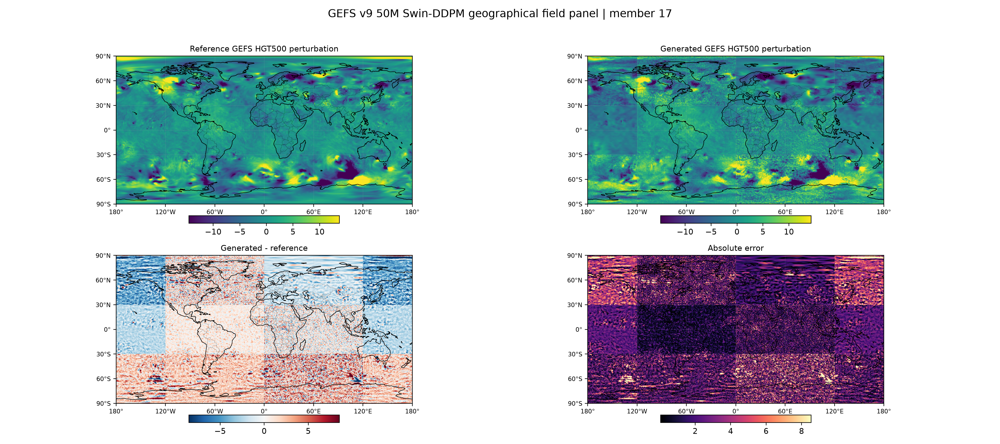
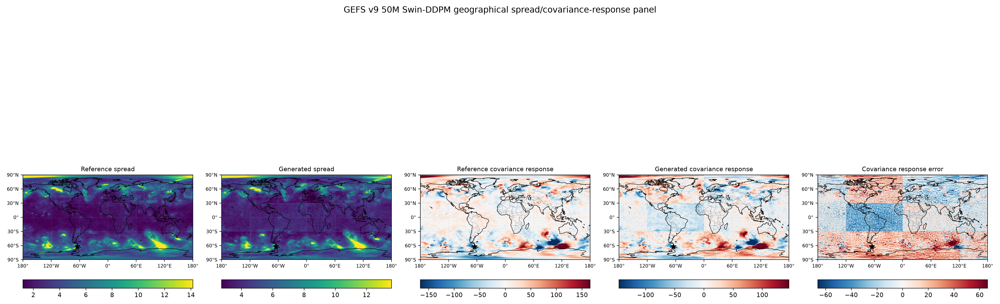
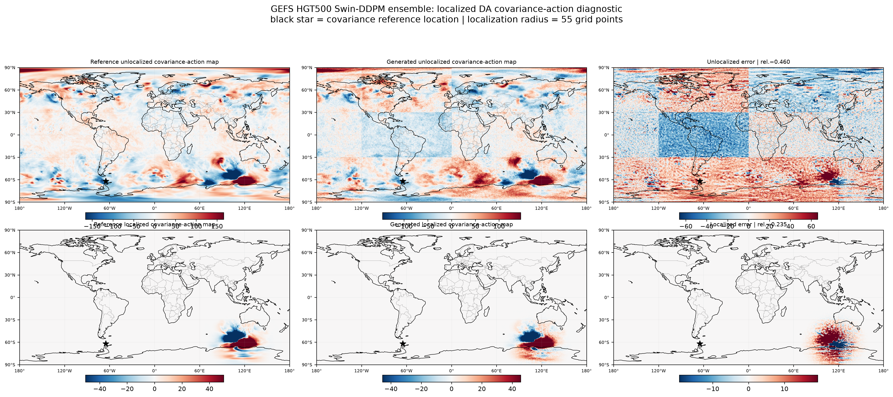

# GEFS Residual DDPM on HPC

This repository contains a curated template workflow for training, sampling, and
evaluating a conditional residual denoising diffusion model for atmospheric
ensemble perturbations.

The workflow is designed for GEFS-style gridded atmospheric fields and shows how
to organize a medium-scale climate-AI generative model on an HPC system using
SLURM.

## Highlights

- Conditional residual DDPM for atmospheric perturbation generation
- Approximately 50M trainable-parameter model scale
- SLURM templates for smoke training, full training, and probing/evaluation
- Ensemble-facing evaluation through spread and covariance-action diagnostics
- Example figures for generated fields and localized covariance-action behavior

## Why residual diffusion?

Instead of generating a complete atmospheric state from scratch, the model learns
ensemble perturbation or residual structure conditioned on atmospheric context.
This makes the workflow naturally connected to ensemble forecasting and
data-assimilation-facing evaluation.

## Example outputs

### Generated atmospheric field example



### Spread / covariance comparison example



### Localized covariance-action example



## Repository structure

```text
configs/   Example configuration files
docs/      Method and HPC usage notes
figures/   Lightweight example figures
scripts/   Training, probing, and evaluation scripts
slurm/     Portable SLURM job templates
## Notes

This repository is a cleaned portfolio template. It does not include raw data,
large model checkpoints, private paths, internal logs, or restricted datasets.
